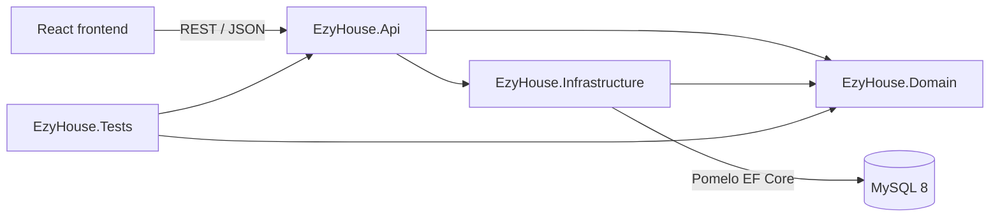
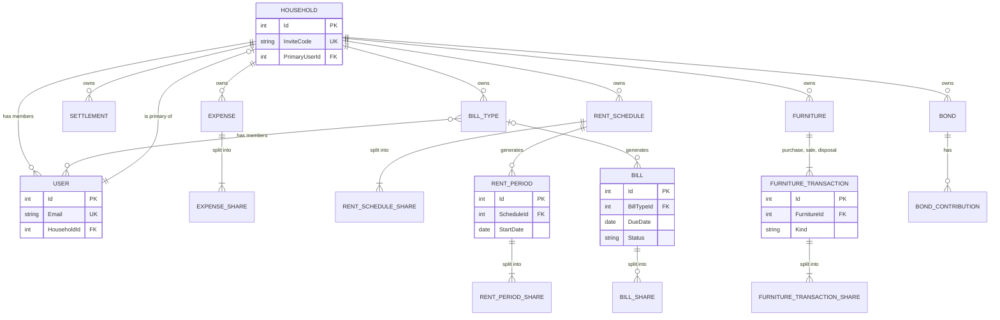

# ezyhouse Backend: Development Plan

This is the plan for building the ezyhouse backend: a C# ASP.NET Core Web API on .NET 9, backed by a MySQL database through Entity Framework Core. The code lives in this folder (`ezyhouse/Backend/`). The React frontend talks to it over the REST contract in [API.md](../API.md).

## Contents

1. [Inputs and decisions](#1-inputs-and-decisions)
2. [Solution layout](#2-solution-layout)
3. [Packages and setup](#3-packages-and-setup)
4. [Data model](#4-data-model)
5. [Design: where each assignment requirement lives](#5-design-where-each-assignment-requirement-lives)
6. [Endpoint implementation checklist](#6-endpoint-implementation-checklist)
7. [NUnit test plan](#7-nunit-test-plan)
8. [Timeline to 16 October](#8-timeline-to-16-october)
9. [Risks and notes](#9-risks-and-notes)
10. [Running the backend](#10-running-the-backend)

---

## 1. Inputs and decisions

### Sources

- **[API.md](../API.md) (v4) is the source of truth** for endpoints, request and response shapes, permissions and business rules. The mockup (`../mockup.html`) follows the same design. Where this plan and API.md disagree, API.md wins.
- **[specifications.md](../specifications.md)** supplies the tech stack and code patterns:
  - ASP.NET Core Web API on .NET 9, built in Visual Studio 2022
  - MySQL through `Pomelo.EntityFrameworkCore.MySql`, using EF Core Code First with migrations
  - NUnit for tests
  - the generic repository (`IRepository<T>`), the split-strategy interface (`ISplitStrategy`), abstract base classes with overridden methods, and the names `EzyHouseDbContext` and `EzyHouse.Tests`
- **[Assignment2_Specification.pdf](../../Research/Assignment2_Specification.pdf)** supplies the marking requirements. Section 5 shows where each one is met.
- **[knowledge.md](../knowledge.md)** is the C# reference from the lectures. Its section numbers are cited throughout as "knowledge §n".

### Parts of specifications.md that are not built

specifications.md describes an earlier design that API.md v4 has replaced. The backend does **not** build the following. The frontend should follow API.md, not specifications.md.

- **The `Flatmate` entity and the `RentExpense` / `UtilityBill` / `AdHocExpense` subclasses.** API.md has users and households instead. Rent, bills and groceries are separate models with different rules, not subclasses of one `Expense`.
- **Room-size and percentage splits.** API.md allows only `equal` and `exact` splits, and lists "percentage or weighted splits" under "Left out on purpose".
- **PayID payment strings and CSV export.** Neither is in API.md.
- **Debt simplification.** API.md says "no debt simplification". Debts are reported pair by pair.
- **The `INotifiable` interface.** API.md has no notifications. Other interfaces cover the two-interface requirement (see Section 5).
- **`GET /api/dashboard/summary` and the other specifications.md endpoint paths.** API.md says the dashboard is built from existing endpoints, and it defines its own paths.

The polymorphism, interface and generics requirements are still met, through classes that fit API.md's domain (see Section 5).

---

## 2. Solution layout

```text
ezyhouse/Backend/
  backend.md                        this plan
  README.md                         run instructions for the tutor (written in the final phase)
  EzyHouse.sln
  src/
    EzyHouse.Domain/                entities, enums, domain interfaces, split strategies,
                                    schedule and balance logic. References nothing else.
    EzyHouse.Infrastructure/        EzyHouseDbContext, entity configurations, Repository<T>,
                                    migrations, demo seed data. References Domain.
    EzyHouse.Api/                   controllers, DTOs, application services, JWT auth,
                                    exception handler, Program.cs. References Domain and Infrastructure.
  tests/
    EzyHouse.Tests/                 NUnit tests. References Domain and Api.
```

The layers depend in one direction only, so no two projects depend on each other. The domain rules (splitting, schedules, balances) have no database or web code in them, which makes them easy to unit-test. This gives the high cohesion and low coupling the marking guide asks for.



### Folders inside each project

```text
EzyHouse.Domain/
  Entities/          User, Household, Expense, Settlement, RentSchedule, RentPeriod,
                     BillType, Bill, Furniture, FurnitureTransaction (+ subclasses), Bond, BondContribution
  Enums/             SplitType, Frequency, BillStatus, FurnitureStatus
  ValueObjects/      Share, PaidShare, ShareInput, LedgerEntry, Debt
  Interfaces/        ISplitStrategy, IBalanceContributor, IRepository<T>, IClock
  Splitting/         EqualSplitStrategy, ExactSplitStrategy, SplitCalculator
  Scheduling/        RecurringSchedule<TOccurrence>, FrequencyExtensions
  Balances/          BalanceCalculator
  Exceptions/        AppException and subclasses

EzyHouse.Infrastructure/
  Data/              EzyHouseDbContext, Configurations/*.cs, DemoSeeder
  Repositories/      Repository<T>
  Migrations/        generated by dotnet-ef

EzyHouse.Api/
  Controllers/       AuthController, HouseholdController, ExpensesController, BalancesController,
                     SettlementsController, RentController, BillsController, FurnitureController, BondsController
  Dtos/              request and response records matching API.md shapes
  Services/          IAuthService, IHouseholdService, IExpenseService, IBalanceService, IRentService,
                     IBillService, IFurnitureService, IBondService (+ implementations), ICurrentUserContext
  Infrastructure/    AppExceptionHandler, MoneyAttribute, ClaimsPrincipalExtensions, DtoMappingExtensions,
                     SystemClock, JwtTokenService
  Program.cs
```

---

## 3. Packages and setup

### Prerequisites

- Visual Studio 2022 **17.12 or later** with the *ASP.NET and web development* workload. Earlier versions can't build .NET 9 projects.
- .NET 9 SDK.
- MySQL Server 8.0 or later. MySQL Workbench is optional but useful for checking the data.
- The EF Core command-line tool: `dotnet tool install --global dotnet-ef --version 9.*`

### Scaffolding the solution

Run these from `ezyhouse/Backend/`:

```bash
dotnet new sln -n EzyHouse
dotnet new classlib -n EzyHouse.Domain         -o src/EzyHouse.Domain         -f net9.0
dotnet new classlib -n EzyHouse.Infrastructure -o src/EzyHouse.Infrastructure -f net9.0
dotnet new webapi   -n EzyHouse.Api            -o src/EzyHouse.Api            -f net9.0 --use-controllers
dotnet new nunit    -n EzyHouse.Tests          -o tests/EzyHouse.Tests        -f net9.0

dotnet sln add src/EzyHouse.Domain src/EzyHouse.Infrastructure src/EzyHouse.Api tests/EzyHouse.Tests

dotnet add src/EzyHouse.Infrastructure reference src/EzyHouse.Domain
dotnet add src/EzyHouse.Api reference src/EzyHouse.Domain src/EzyHouse.Infrastructure
dotnet add tests/EzyHouse.Tests reference src/EzyHouse.Domain src/EzyHouse.Api
```

### NuGet packages

Keep every `Microsoft.EntityFrameworkCore.*` package on the **same 9.0.x version** that Pomelo 9 depends on. Mixing versions causes run-time errors.

- **EzyHouse.Infrastructure:**
  - `Pomelo.EntityFrameworkCore.MySql` 9.x
- **EzyHouse.Api:**
  - `Microsoft.EntityFrameworkCore.Design` 9.0.x, which `dotnet ef` needs in the start-up project
  - `Microsoft.EntityFrameworkCore.Tools` 9.0.x (optional), for the Package Manager Console commands `Add-Migration` and `Update-Database`
  - `Microsoft.AspNetCore.Authentication.JwtBearer` 9.0.x
  - `BCrypt.Net-Next`, for password hashing
  - `Swashbuckle.AspNetCore`, for Swagger UI to test endpoints during development
- **EzyHouse.Tests:**
  - `NUnit`, `NUnit3TestAdapter`, `Microsoft.NET.Test.Sdk` and `NUnit.Analyzers`, which the `nunit` template already includes
  - `Microsoft.EntityFrameworkCore.Sqlite` 9.0.x, for service tests against an in-memory SQLite database

### MySQL database and user

Run once in MySQL Workbench or the `mysql` client:

```sql
CREATE DATABASE ezyhouse CHARACTER SET utf8mb4 COLLATE utf8mb4_unicode_ci;
CREATE USER 'ezyhouse'@'localhost' IDENTIFIED BY 'change-me';
GRANT ALL PRIVILEGES ON ezyhouse.* TO 'ezyhouse'@'localhost';
FLUSH PRIVILEGES;
```

### Configuration (`EzyHouse.Api/appsettings.json`)

```json
{
  "ConnectionStrings": {
    "EzyHouse": "Server=localhost;Port=3306;Database=ezyhouse;User=ezyhouse;Password=change-me;"
  },
  "Jwt": {
    "Issuer": "ezyhouse",
    "Audience": "ezyhouse-web",
    "Key": "replace-with-a-random-secret-of-at-least-32-characters",
    "ExpiryMinutes": 1440
  },
  "Cors": {
    "AllowedOrigins": [ "http://localhost:5173" ]
  }
}
```

Keep the real password and JWT key out of git. During development, use `dotnet user-secrets` (for example `dotnet user-secrets set "Jwt:Key" "..."` in the Api project). For the submission zip, put working demo values in `appsettings.Development.json` so the tutor can run it straight away.

### Wiring in `Program.cs`

```csharp
var builder = WebApplication.CreateBuilder(args);

// Database: pin the server version so design-time tools don't need a live connection
builder.Services.AddDbContext<EzyHouseDbContext>(options =>
    options.UseMySql(builder.Configuration.GetConnectionString("EzyHouse"),
                     new MySqlServerVersion(new Version(8, 0, 36))));

// JSON: camelCase (the default) and lowercase camelCase enum strings, as API.md requires
builder.Services.AddControllers().AddJsonOptions(o =>
    o.JsonSerializerOptions.Converters.Add(new JsonStringEnumConverter(JsonNamingPolicy.CamelCase)));

// Errors: AppException subclasses become ProblemDetails responses
builder.Services.AddProblemDetails();
builder.Services.AddExceptionHandler<AppExceptionHandler>();

// Authentication: JWT bearer tokens
builder.Services.AddAuthentication(JwtBearerDefaults.AuthenticationScheme)
    .AddJwtBearer(options =>
    {
        options.MapInboundClaims = false;   // keep "sub" as "sub"
        options.TokenValidationParameters = new TokenValidationParameters
        {
            ValidIssuer = builder.Configuration["Jwt:Issuer"],
            ValidAudience = builder.Configuration["Jwt:Audience"],
            IssuerSigningKey = new SymmetricSecurityKey(
                Encoding.UTF8.GetBytes(builder.Configuration["Jwt:Key"]!)),
        };
    });
builder.Services.AddAuthorization();

// CORS for the React dev server
builder.Services.AddCors(o => o.AddDefaultPolicy(p => p
    .WithOrigins(builder.Configuration.GetSection("Cors:AllowedOrigins").Get<string[]>()!)
    .AllowAnyHeader().AllowAnyMethod()));

// Application services (see Section 5)
builder.Services.AddScoped(typeof(IRepository<>), typeof(Repository<>));
builder.Services.AddSingleton<IClock, SystemClock>();
builder.Services.AddSingleton<ISplitStrategy, EqualSplitStrategy>();
builder.Services.AddSingleton<ISplitStrategy, ExactSplitStrategy>();
builder.Services.AddSingleton<SplitCalculator>();
builder.Services.AddSingleton<BalanceCalculator>();
builder.Services.AddScoped<ICurrentUserContext, CurrentUserContext>();
builder.Services.AddScoped<IHouseholdService, HouseholdService>();
// ... one AddScoped line per service interface

builder.Services.AddEndpointsApiExplorer();
builder.Services.AddSwaggerGen();   // plus a bearer security definition, so Swagger UI can send tokens

var app = builder.Build();

if (app.Environment.IsDevelopment())
{
    using var scope = app.Services.CreateScope();
    var db = scope.ServiceProvider.GetRequiredService<EzyHouseDbContext>();
    db.Database.Migrate();          // create or upgrade the schema
    DemoSeeder.Seed(db);            // insert demo data if the database is empty
    app.UseSwagger();
    app.UseSwaggerUI();
}

app.UseExceptionHandler();
app.UseCors();
app.UseAuthentication();
app.UseAuthorization();
app.MapControllers();
app.Run();
```

Every controller except `AuthController` gets `[Authorize]`, so requests without a valid token receive 401.

### Migrations

Run these from `ezyhouse/Backend/`:

```bash
dotnet ef migrations add InitialCreate --project src/EzyHouse.Infrastructure --startup-project src/EzyHouse.Api
dotnet ef database update            --project src/EzyHouse.Infrastructure --startup-project src/EzyHouse.Api
```

Add a new migration whenever an entity or configuration changes. The Development start-up calls `Migrate()`, so pulling the latest code and running the API is enough to bring a teammate's database up to date.

---

## 4. Data model

The schema is built Code First (knowledge §11): we write the entity classes in `EzyHouse.Domain`, describe keys, indexes and relationships in `IEntityTypeConfiguration<T>` classes in `EzyHouse.Infrastructure/Data/Configurations/`, and let migrations create the MySQL tables.

### Conventions

- **Keys:** every entity has an `int Id` primary key, which MySQL auto-increments. API.md says IDs are integers.
- **Money:** `decimal`, configured with `HasPrecision(10, 2)`, which maps to MySQL `DECIMAL(10,2)`. Never use `double` for money.
- **Dates:** `DateOnly`, which maps to MySQL `DATE`. System.Text.Json already serialises `DateOnly` as `YYYY-MM-DD`, as API.md requires.
- **Enums:** stored as strings (`HasConversion<string>()`) so rows are readable in MySQL Workbench, and returned in JSON as lowercase camelCase strings.
  - `SplitType`: `Equal`, `Exact`
  - `Frequency`: `Weekly`, `Fortnightly`, `Monthly`, `Quarterly`
  - `BillStatus`: `Pending`, `Submitted`
  - `FurnitureStatus`: `Owned`, `Sold`, `Disposed`
- **Household scoping:** every household-owned root entity has a `HouseholdId`. Services always filter on the caller's household, so URLs never contain a household ID (API.md "Conventions").
- **Deleting users:** foreign keys that point at `User` use `DeleteBehavior.Restrict`. Users are never deleted, and leaving a household only clears `User.HouseholdId`, so names stay available in history.

### Shares

API.md uses three share shapes. Two of them are stored, as **owned collections** (`OwnsMany`), each in its own table with a foreign key back to its owner and a navigation to `User`:

- **`Share` { `UserId`, `Amount` }:** owned by `Expense` (table `ExpenseShares`), `RentSchedule` (`RentScheduleShares`) and `FurnitureTransaction` (`FurnitureTransactionShares`).
- **`PaidShare` { `UserId`, `Amount`, `Paid`, `PaidDate?` }:** owned by `RentPeriod` (`RentPeriodShares`) and `Bill` (`BillShares`).
- `ShareInput` { `userId`, `amount?` } is only a request DTO and is never stored.

Shares always store the **calculated** amount, including for equal splits, so later rule changes never rewrite history.

### Entities

**`User`**
- `Id`, `Name`, `Email` (unique index), `PasswordHash`
- `HouseholdId?`: a user belongs to at most one household.

**`Household`**
- `Id`, `Name`, `InviteCode` (unique index, 8 characters), `PrimaryUserId`
- `Members`: the users whose `HouseholdId` matches.
- `Household` → `User` (primary) and `User` → `Household` (membership) form a cycle. The user always exists before the household is created, so EF can save them in one `SaveChanges`.

**`Expense`** (the Groceries tab)
- `Id`, `HouseholdId`, `Description`, `Amount`, `Date`, `PaidByUserId`, `CreatedByUserId`, `SplitType`, `Shares` (owned `Share` collection)
- Implements `IBalanceContributor` (Section 5).

**`Settlement`**
- `Id`, `HouseholdId`, `FromUserId`, `ToUserId`, `Amount`, `Date`, `CreatedByUserId`
- Never updated or deleted. To fix a mistake, record a settlement the other way.
- Implements `IBalanceContributor`.

**`RentSchedule`** (derives from `RecurringSchedule<RentPeriod>`)
- `Id`, `HouseholdId`, `Amount`, `Frequency`, `StartDate`, `EndDate?`, `SplitType`, `Shares` (owned `Share` collection)
- Has many `RentPeriod`s, with **cascade delete**: deleting a schedule deletes its periods.

**`RentPeriod`**
- `Id`, `ScheduleId`, `StartDate`, `EndDate`, `Amount`, `PayeeUserId`, `Shares` (owned `PaidShare` collection)
- **Unique index on `(ScheduleId, StartDate)`**, which prevents duplicate periods when two requests generate at the same time.

**`BillType`** (derives from `RecurringSchedule<Bill>`)
- `Id`, `HouseholdId`, `Name`, `Frequency`, `StartDate`, `EndDate?`
- `Members`: a many-to-many link to `User` through the join table `BillTypeMembers`.

**`Bill`**
- `Id`, `BillTypeId?`, `BillTypeName`, `DueDate`, `Status`, `Amount?`, `PayeeUserId?`, `SubmittedDate?`, `Shares` (owned `PaidShare` collection, empty while pending)
- **Unique index on `(BillTypeId, DueDate)`.**
- `BillTypeName` is a copy of the type's name taken when the placeholder is created. The FK to `BillType` is nullable with **`DeleteBehavior.SetNull`**. When a bill type is deleted, the service first deletes its pending placeholders, and the database then sets `BillTypeId` to null on the submitted bills, which stay as history and still display their name. API.md returns `billType: { id, name }`, so `id` can be `null` for such bills.

**`Furniture`**
- `Id`, `HouseholdId`, `Name`, `Status`, `CreatedByUserId`
- `Transactions`: a one-to-many link to `FurnitureTransaction`, with cascade delete.
- Unmapped convenience properties, computed with LINQ:
  - `Purchase => Transactions.OfType<FurniturePurchase>().Single()`
  - `Sale => Transactions.OfType<FurnitureSale>().SingleOrDefault()`
  - `Disposal => Transactions.OfType<FurnitureDisposal>().SingleOrDefault()`

**`FurnitureTransaction`** (abstract), with subclasses `FurniturePurchase`, `FurnitureSale` and `FurnitureDisposal`
- `Id`, `FurnitureId`, `Date`, `Amount`, `CounterpartyUserId`, `SplitType`, `Shares` (owned `Share` collection)
- `CounterpartyUserId` is the person who paid (`paidBy`) for a purchase or disposal, and the person who received the cash (`receivedBy`) for a sale.
- Mapped as **TPH (table per hierarchy)**: one `FurnitureTransactions` table with a `Kind` discriminator column. A unique index on `(FurnitureId, Kind)` ensures at most one of each kind per item.
- Implements `IBalanceContributor`, and each subclass decides who owes whom (Section 5).

**`Bond`**
- `Id`, `HouseholdId`, `Total`, `PaidDate`
- `Contributions`: a one-to-many link to `BondContribution`, with cascade delete.
- `Outstanding` is unmapped: `Total - Contributions.Sum(c => c.Amount)`.

**`BondContribution`**
- `Id`, `BondId`, `UserId`, `Amount`, `Date`

### ER diagram



Every share table also has a `UserId` foreign key to `USER`. Those links are left out of the diagram to keep it readable.

---

## 5. Design: where each assignment requirement lives

The marking guide's code requirements (6 marks) and objectives should each show up in code that does real work, not in a token example. This section names the classes that cover each one and sketches the important logic. A summary table is at the end.

### 5.1 Splitting money: `ISplitStrategy` (interface, polymorphism, generics)

API.md's splitting rules apply everywhere a split appears: expenses, rent schedules, bill submissions and furniture. One strategy class per `SplitType` keeps the rules in one place.

```csharp
public interface ISplitStrategy
{
    SplitType Type { get; }
    IReadOnlyList<Share> Split(decimal total, IReadOnlyList<ShareInput> shares);
}

public sealed class EqualSplitStrategy : ISplitStrategy
{
    public SplitType Type => SplitType.Equal;

    // The server divides the amount. Leftover cents go to the first share.
    public IReadOnlyList<Share> Split(decimal total, IReadOnlyList<ShareInput> shares)
    {
        decimal each = Math.Floor(total * 100m / shares.Count) / 100m;
        decimal leftover = total - each * shares.Count;
        return shares.Select((s, index) => new Share(s.UserId, index == 0 ? each + leftover : each))
                     .ToList();
    }
}

public sealed class ExactSplitStrategy : ISplitStrategy
{
    public SplitType Type => SplitType.Exact;

    // Share amounts must add up to the total. Otherwise -> 400.
    public IReadOnlyList<Share> Split(decimal total, IReadOnlyList<ShareInput> shares)
    {
        if (shares.Any(s => s.Amount is null))
            throw new ValidationFailedException("Every share needs an amount when splitType is exact.");

        decimal sum = shares.Sum(s => s.Amount!.Value);
        if (sum != total)
            throw new ValidationFailedException($"Shares add up to {sum:0.00} but the total is {total:0.00}.");

        return shares.Select(s => new Share(s.UserId, s.Amount!.Value)).ToList();
    }
}
```

For example, splitting $100.00 equally three ways gives $33.34, $33.33 and $33.33.

`SplitCalculator` receives every registered `ISplitStrategy` through dependency injection and stores them in a `Dictionary<SplitType, ISplitStrategy>`. It applies the shared rules first, then delegates to the right strategy:

```csharp
public sealed class SplitCalculator(IEnumerable<ISplitStrategy> strategies)
{
    private readonly Dictionary<SplitType, ISplitStrategy> byType = strategies.ToDictionary(s => s.Type);

    public IReadOnlyList<Share> Split(decimal total, SplitType type,
                                      IReadOnlyList<ShareInput> shares, IReadOnlySet<int> memberIds)
    {
        if (shares.Count == 0)
            throw new ValidationFailedException("At least one person must be in the split.");
        if (shares.Select(s => s.UserId).Distinct().Count() != shares.Count)
            throw new ValidationFailedException("A person can only appear once in a split.");
        if (shares.Any(s => !memberIds.Contains(s.UserId)))
            throw new ValidationFailedException("Everyone in a split must be a current household member.");

        return byType[type].Split(total, shares);
    }
}
```

Adding a new split type later only needs a new class and one `AddSingleton` line. No existing code changes.

### 5.2 Recurring schedules: `RecurringSchedule<TOccurrence>` (inheritance, overriding, generics, enumerators, delegates)

Rent schedules and bill types work the same way. Each has a frequency, a start date and an optional end date, and each lazily produces occurrences up to today: rent **periods** and bill **placeholders**. A generic abstract base class holds the shared date logic. Each subclass overrides how one occurrence is built.

```csharp
public record ScheduleSlot(int Step, DateOnly Start, DateOnly End);

public abstract class RecurringSchedule<TOccurrence>
{
    public int Id { get; set; }
    public int HouseholdId { get; set; }
    public Frequency Frequency { get; set; }
    public DateOnly StartDate { get; set; }
    public DateOnly? EndDate { get; set; }

    // Iterator: yields each slot from StartDate until upTo or EndDate, whichever comes first.
    public IEnumerable<ScheduleSlot> GetSlots(DateOnly upTo)
    {
        DateOnly last = EndDate is { } end && end < upTo ? end : upTo;
        for (int step = 0; ; step++)
        {
            DateOnly start = StartDate.AddFrequency(Frequency, step);
            if (start > last) yield break;
            DateOnly nextStart = StartDate.AddFrequency(Frequency, step + 1);
            DateOnly slotEnd = nextStart.AddDays(-1);
            if (EndDate is { } scheduleEnd && slotEnd > scheduleEnd) slotEnd = scheduleEnd;
            yield return new ScheduleSlot(step, start, slotEnd);
        }
    }

    public DateOnly? GetNextDueDate(DateOnly today) =>
        GetSlots(today.AddMonths(4)).Where(s => s.Start > today)
                                    .Select(s => (DateOnly?)s.Start)
                                    .FirstOrDefault();

    public abstract TOccurrence CreateOccurrence(ScheduleSlot slot, int primaryUserId);
}

public class RentSchedule : RecurringSchedule<RentPeriod>
{
    public decimal Amount { get; set; }
    public SplitType SplitType { get; set; }
    public List<Share> Shares { get; set; } = new();

    // The payee is whoever is primary now. The payee's own share is ticked automatically.
    public override RentPeriod CreateOccurrence(ScheduleSlot slot, int primaryUserId) => new()
    {
        ScheduleId = Id,
        StartDate = slot.Start,
        EndDate = slot.End,
        Amount = Amount,
        PayeeUserId = primaryUserId,
        Shares = Shares.Select(s => new PaidShare(s.UserId, s.Amount)
        {
            Paid = s.UserId == primaryUserId,
            PaidDate = s.UserId == primaryUserId ? slot.Start : null,
        }).ToList(),
    };
}

public class BillType : RecurringSchedule<Bill>
{
    public string Name { get; set; } = "";
    public List<User> Members { get; set; } = new();

    // A placeholder has no amount, payee or shares until the primary submits it.
    public override Bill CreateOccurrence(ScheduleSlot slot, int primaryUserId) => new()
    {
        BillTypeId = Id,
        BillTypeName = Name,
        DueDate = slot.Start,
        Status = BillStatus.Pending,
    };
}
```

- Slot dates are always calculated from `StartDate` plus a step count, never from the previous slot. This avoids month-end drift: a monthly schedule starting 31 January gives 28 February (29 in a leap year), then 31 March, not 28 March.
- One generic helper in the Api layer generates the missing occurrences for **either** kind of schedule:

```csharp
public static List<TOccurrence> FindMissing<TOccurrence>(
    RecurringSchedule<TOccurrence> schedule, IReadOnlySet<DateOnly> existingStarts,
    DateOnly today, int primaryUserId) =>
    schedule.GetSlots(today)
            .Where(slot => !existingStarts.Contains(slot.Start))
            .Select(slot => schedule.CreateOccurrence(slot, primaryUserId))
            .ToList();
```

- `FrequencyExtensions.AddFrequency` is an extension method backed by a dictionary of delegates:

```csharp
public static class FrequencyExtensions
{
    private static readonly Dictionary<Frequency, Func<DateOnly, int, DateOnly>> Steppers = new()
    {
        [Frequency.Weekly]      = (date, steps) => date.AddDays(7 * steps),
        [Frequency.Fortnightly] = (date, steps) => date.AddDays(14 * steps),
        [Frequency.Monthly]     = (date, steps) => date.AddMonths(steps),
        [Frequency.Quarterly]   = (date, steps) => date.AddMonths(3 * steps),
    };

    public static DateOnly AddFrequency(this DateOnly start, Frequency frequency, int steps) =>
        Steppers[frequency](start, steps);
}
```

### 5.3 Balances: `IBalanceContributor` and `BalanceCalculator` (interface, overriding, LINQ with lambdas)

Balances include **expenses, furniture and settlements only** (API.md). Each of those entity types knows who owes whom because of it, and reports that as ledger entries. The calculator never needs to know which type it is reading.

```csharp
public record LedgerEntry(int DebtorId, int CreditorId, decimal Amount);
public record Debt(int FromUserId, int ToUserId, decimal Amount);

public interface IBalanceContributor
{
    IEnumerable<LedgerEntry> GetLedgerEntries();
}
```

How each type implements it:

- **`Expense`:** each share holder other than the payer owes the payer their share.
- **`FurnitureTransaction`** (abstract) declares `public abstract IEnumerable<LedgerEntry> GetLedgerEntries();`.
  - **`FurniturePurchase`** and **`FurnitureDisposal`** override it like an expense: share holders owe the person who paid.
  - **`FurnitureSale`** overrides it **the other way round**: the person who received the cash owes every other share holder their share. Using API.md's couch example, Cara receives $300 and owes Alice and Bob $100 each.
- **`Settlement`:** when `from` pays `to`, the result is `new LedgerEntry(DebtorId: ToUserId, CreditorId: FromUserId, Amount)`, which cancels out the same amount of what `from` owed.

```csharp
public sealed class BalanceCalculator
{
    public (IReadOnlyDictionary<int, decimal> Nets, IReadOnlyList<Debt> Debts) Calculate(
        IEnumerable<IBalanceContributor> contributors, IEnumerable<int> memberIds)
    {
        List<LedgerEntry> entries = contributors.SelectMany(c => c.GetLedgerEntries())
                                                .Where(e => e.DebtorId != e.CreditorId)
                                                .ToList();

        // Net per member: positive means the household owes you, negative means you owe.
        var nets = memberIds.ToDictionary(
            id => id,
            id => entries.Where(e => e.CreditorId == id).Sum(e => e.Amount)
                - entries.Where(e => e.DebtorId == id).Sum(e => e.Amount));

        // Pairwise debts with no simplification: net each pair of people separately.
        var debts = entries
            .GroupBy(e => (Low: Math.Min(e.DebtorId, e.CreditorId), High: Math.Max(e.DebtorId, e.CreditorId)))
            .Select(g => new { g.Key, Net = g.Sum(e => e.DebtorId == g.Key.Low ? e.Amount : -e.Amount) })
            .Where(x => x.Net != 0)
            .Select(x => x.Net > 0
                ? new Debt(x.Key.Low, x.Key.High, x.Net)
                : new Debt(x.Key.High, x.Key.Low, -x.Net))
            .ToList();

        return (nets, debts);
    }
}
```

The same `debts` list drives the leave-household guard (Section 6.2), as API.md v4 requires.

### 5.4 Generic repository: `IRepository<T>` (interface, generics)

This is the interface from specifications.md, with `Query()` and `SaveChangesAsync()` added so services can compose LINQ queries and save in one unit of work:

```csharp
public interface IRepository<T> where T : class
{
    IQueryable<T> Query();
    Task<IEnumerable<T>> GetAllAsync();
    Task<T?> GetByIdAsync(int id);
    Task AddAsync(T entity);
    void Update(T entity);
    void Delete(T entity);
    Task SaveChangesAsync();
}
```

`Repository<T>` in Infrastructure wraps `EzyHouseDbContext.Set<T>()`. It is registered once as an open generic (`AddScoped(typeof(IRepository<>), typeof(Repository<>))`), so services just ask for `IRepository<Expense>`, `IRepository<Bill>` and so on. Services add `.Include(...)` to `Query()` when they need related data, such as shares and their users.

### 5.5 Other interfaces

- **`IClock`** { `DateOnly Today { get; }` }: every "today" in the rules goes through this, including period generation, settlement dates and `paidDate`. `SystemClock` uses the server's local date. Tests pass a `FixedClock` so the expected results never change.
- **`ICurrentUserContext`:** reads the user ID from the JWT `sub` claim and loads the caller's user and household.
  - `RequireHouseholdAsync()` throws `ForbiddenException` (403) when the caller isn't in a household. The one exception is `GET /api/household`, which returns 404 in that case, as API.md specifies.
  - `RequirePrimaryAsync()` throws 403 when the caller isn't the primary.
- **One service interface per API area** (`IAuthService`, `IHouseholdService`, `IExpenseService`, `IBalanceService`, `IRentService`, `IBillService`, `IFurnitureService`, `IBondService`). Controllers depend on these interfaces rather than concrete classes, which keeps controllers thin and lets tests swap implementations.

### 5.6 Error handling and validation

**Custom exceptions** form a small hierarchy. Each subclass overrides its own status code, which is one more piece of useful polymorphism:

```csharp
public abstract class AppException(string message) : Exception(message)
{
    public abstract int StatusCode { get; }
    public abstract string Title { get; }
}

public sealed class ValidationFailedException(string m) : AppException(m) { public override int StatusCode => 400; public override string Title => "Validation failed"; }
public sealed class ForbiddenException(string m)        : AppException(m) { public override int StatusCode => 403; public override string Title => "Not allowed"; }
public sealed class NotFoundException(string m)         : AppException(m) { public override int StatusCode => 404; public override string Title => "Not found"; }
public sealed class BusinessRuleException(string m)     : AppException(m) { public override int StatusCode => 409; public override string Title => "Breaks a business rule"; }
```

The 400 exception is named `ValidationFailedException` so it doesn't clash with `System.ComponentModel.DataAnnotations.ValidationException`.

**`AppExceptionHandler`** implements `IExceptionHandler` and turns any `AppException` into a ProblemDetails response, matching API.md's error convention. Any other exception falls through and becomes a 500, without leaking a stack trace outside Development.

```csharp
public sealed class AppExceptionHandler(IProblemDetailsService problemDetails) : IExceptionHandler
{
    public async ValueTask<bool> TryHandleAsync(HttpContext http, Exception exception, CancellationToken ct)
    {
        if (exception is not AppException app) return false;
        http.Response.StatusCode = app.StatusCode;
        return await problemDetails.TryWriteAsync(new ProblemDetailsContext
        {
            HttpContext = http,
            Exception = exception,
            ProblemDetails = { Status = app.StatusCode, Title = app.Title, Detail = app.Message },
        });
    }
}
```

**Input validation** happens at two levels:

1. **Request DTOs** use DataAnnotations (`[Required]`, `[EmailAddress]`, `[StringLength]`, `[MinLength]`) plus a custom **`[Money]`** attribute. `[ApiController]` automatically returns a 400 ValidationProblemDetails when any of these fail.

```csharp
public sealed class MoneyAttribute : ValidationAttribute
{
    public bool AllowZero { get; set; }   // a disposal amount may be 0

    public override bool IsValid(object? value) => value switch
    {
        null => true,                       // [Required] reports missing values
        decimal d => (AllowZero ? d >= 0 : d > 0) && d.HasAtMostTwoDecimals(),
        _ => false,
    };
}

public static class MoneyExtensions
{
    // API.md: money has at most 2 decimal places. More decimals -> 400.
    public static bool HasAtMostTwoDecimals(this decimal value) => decimal.Round(value, 2) == value;
}
```

2. **Services** check the rules that need data: membership, the split rules (5.1), permissions (403), and business rules (409).

### 5.7 Extension methods, enums, properties and anonymous methods

These are assignment objectives in their own right:

- **Extension methods:**
  - `DateOnly.AddFrequency()` (5.2)
  - `decimal.HasAtMostTwoDecimals()` (5.6)
  - `ClaimsPrincipal.GetUserId()`, which parses the `sub` claim
  - `ToDto()` mappers in `DtoMappingExtensions`, for example `expense.ToDto()` and `bill.ToDto()`, which keep mapping code out of controllers
- **Enums:** `SplitType`, `Frequency`, `BillStatus` and `FurnitureStatus`, used throughout and serialised as strings.
- **Properties:**
  - computed, read-only properties: `Bond.Outstanding`, and `Furniture.Purchase` / `Sale` / `Disposal`
  - get-only `StatusCode` overrides on the exceptions
- **Enumerators:** `RecurringSchedule.GetSlots()` is an iterator that uses `yield return`.
- **An explicit anonymous method used with LINQ.** The marking guide asks for "anonymous method with LINQ using lambda expression". Lambdas are used everywhere, but to make this obvious to the marker, the leave guard also uses one `delegate` anonymous method:

```csharp
Func<PaidShare, bool> isUnpaid = delegate (PaidShare share) { return !share.Paid; };
bool owesRent = periods.SelectMany(p => p.Shares).Where(isUnpaid).Any(s => s.UserId == userId);
```

### 5.8 Requirement summary

| Requirement | Where it is met |
|---|---|
| Polymorphism (at least one, useful) | `RecurringSchedule<T>.CreateOccurrence` overrides; `FurnitureTransaction.GetLedgerEntries` overrides; `AppException.StatusCode` overrides; overloaded `Share` / `PaidShare` constructors |
| At least two interfaces | `ISplitStrategy`, `IBalanceContributor`, `IRepository<T>`, `IClock`, `ICurrentUserContext`, service interfaces |
| Generics / generic collections | `IRepository<T>`, `Repository<T>`, `RecurringSchedule<TOccurrence>`, `FindMissing<T>`, `Dictionary<SplitType, ISplitStrategy>`, `List<Share>` |
| Anonymous method with LINQ and lambda | `BalanceCalculator`, `SplitCalculator`, the leave guard (explicit `delegate`) |
| Delegates | `Dictionary<Frequency, Func<DateOnly, int, DateOnly>>`, `Func<PaidShare, bool>` |
| Enumerators, properties, extension methods | `GetSlots()` iterator; computed properties; `AddFrequency`, `HasAtMostTwoDecimals`, `GetUserId`, `ToDto` |
| Database, EF and LINQ (bonus) | MySQL through Pomelo EF Core, Code First migrations, LINQ to Entities in every service |
| Error handling and validation | `AppException` hierarchy, `AppExceptionHandler`, `[Money]` and DataAnnotations, service rule checks |
| NUnit | `EzyHouse.Tests` (Section 7) |
| High cohesion, low coupling | Three layered projects, interface-based dependency injection, one service per API area |

---

## 6. Endpoint implementation checklist

This is one subsection per area of [API.md](../API.md). Tick each box when the endpoint works in Swagger and has been tried from the frontend. API.md marks some rules with ⚠ as judgement calls. They are implemented as written, so if the team changes one, update API.md first.

These rules apply to every endpoint:

- Every endpoint except `/api/auth/*` needs `[Authorize]`. A missing or bad token gives **401**.
- Every household endpoint calls `ICurrentUserContext.RequireHouseholdAsync()` first. A caller with no household gets **403**.
- A record that doesn't exist, or belongs to another household, gives **404**. Returning 404 rather than 403 avoids revealing that the record exists.
- Wherever a split appears, it goes through `SplitCalculator` (5.1), which applies API.md's splitting rules: membership, equal or exact, and no duplicates.
- Responses use the shapes in API.md, built by the `ToDto()` mappers. `UserRef` is `{ id, name }`.

### 6.1 Auth (`AuthController`, `IAuthService`)

- [ ] **`POST /api/auth/register`** `{ name, email, password }` returns `AuthResult`.
  - Validate the name, a valid email address, and a password of at least 8 characters (400).
  - Store the email in lower case. A duplicate email gives **409**.
  - Hash the password with `BCrypt.HashPassword` and never store plain text.
- [ ] **`POST /api/auth/login`** `{ email, password }` returns `AuthResult`.
  - An unknown email or wrong password gives **401**, with the same message for both so the response doesn't reveal which emails exist.
- [ ] **`GET /api/me`** returns `User` { `id`, `name`, `email`, `householdId` }.
- `JwtTokenService` issues a token with the claims `sub` (the user ID), `name` and `email`. It expires after `Jwt:ExpiryMinutes`.

### 6.2 Household (`HouseholdController`, `IHouseholdService`)

- [ ] **`POST /api/household`** `{ name }` returns `Household`.
  - A caller already in a household gets **409**.
  - Generate a unique 8-character invite code from uppercase letters and digits, leaving out look-alikes such as `0`/`O` and `1`/`I`. Retry if the code already exists.
  - The caller becomes `primary` and a member.
- [ ] **`GET /api/household`** returns `Household`. A caller who isn't in a household gets **404**, not 403.
- [ ] **`POST /api/household/join`** `{ inviteCode }` returns `Household`.
  - An unknown code gives **404**. A caller already in a household gets **409**.
  - The new member is **not** added to any rent schedule or bill type automatically.
- [ ] **`PUT /api/household/primary`** `{ userId }` returns `Household`.
  - Only the primary can call it (**403**). A target who isn't a member gives **400**.
  - Existing unpaid rent and bill shares stay owed to the old primary. Only periods and bills created after this point use the new primary.
- [ ] **`POST /api/household/leave`** returns **204**. It is blocked with **409** while any of these is true. The response's `detail` says which:
  1. The caller appears in any entry of `debts` from the balance calculation, as either `from` or `to`.
  2. Any rent share the caller owes is unpaid, **or** the caller is the payee of a period with any unpaid share.
  3. The caller is in the shares of a rent schedule that hasn't ended (`EndDate` is null or on or after today).
  4. Any bill share the caller owes is unpaid, **or** the caller is the payee of a submitted bill with any unpaid share.
  5. The caller is primary and other members remain. They must hand over primary first.
  
  When leaving succeeds:
  - Remove the caller from every bill type's `Members`.
  - Set `User.HouseholdId` to null.
  - Leave furniture shares untouched as history. The item stays with the household, and the caller can't be in future splits because they are no longer a member.
  - **Open question:** API.md doesn't say what happens when the last member leaves. The plan keeps the household row and its history with no members, and the invite code stops working. Raise this with the team before building it.

### 6.3 Expenses: the Groceries tab (`ExpensesController`, `IExpenseService`)

- [ ] **`GET /api/expenses`** returns `Expense[]`, newest `date` first, with `paidBy`, `createdBy` and `shares[].user` included.
- [ ] **`GET /api/expenses/{id}`** returns `Expense`, or **404**.
- [ ] **`POST /api/expenses`** with an `ExpenseInput` returns `Expense`.
  - `description` is required. `amount` must pass `[Money]`. `date` is required.
  - `paidByUserId` must be a current member (**400**).
  - The shares go through `SplitCalculator`. `createdBy` is the caller.
- [ ] **`PUT /api/expenses/{id}`** with an `ExpenseInput` returns `Expense`. Only the creator can call it (**403**). It replaces all fields and recalculates the shares.
- [ ] **`DELETE /api/expenses/{id}`** returns **204**. Only the creator can call it (**403**).

### 6.4 Balances and settle-up (`BalancesController`, `SettlementsController`, `IBalanceService`)

- [ ] **`GET /api/balances`** returns `Balances` { `members: [{ user, net }]`, `debts: [{ from, to, amount }]` }.
  - Load the household's expenses, furniture transactions and settlements, all as `IBalanceContributor`s, and run `BalanceCalculator` (5.3).
  - **Rent, bills and bond are excluded.**
  - `members` lists current members only. `net > 0` means the household owes that member.
- [ ] **`GET /api/settlements`** returns `Settlement[]`, newest first.
- [ ] **`POST /api/settlements`** `{ fromUserId, toUserId, amount }` returns `Settlement`.
  - Both people must be current members, and `from` can't be `to` (**400**). `amount` must pass `[Money]`.
  - Only the `from` or `to` person can record it (**403**).
  - `date` is today (from `IClock`). `createdBy` is the caller.
  - Any positive amount is allowed, even more than is owed, because API.md places no cap. There is no update or delete endpoint.

### 6.5 Rent: the Rent tab (`RentController`, `IRentService`)

- [ ] **`GET /api/rent-schedules`** returns `RentSchedule[]`. Each includes `nextDueDate` from `GetNextDueDate(today)`, which is null once the schedule has ended.
- [ ] **`POST /api/rent-schedules`** with a `RentScheduleInput` returns `RentSchedule`.
  - Only the primary can call it (**403**). `amount` must pass `[Money]`, and `endDate` must be on or after `startDate` (**400**).
  - The shares go through `SplitCalculator`, and the calculated amounts are stored.
- [ ] **`PUT /api/rent-schedules/{id}`** returns `RentSchedule`. Only the primary can call it. It only affects periods created **after** the edit, because existing periods keep their copied shares.
- [ ] **`DELETE /api/rent-schedules/{id}`** returns **204**. Only the primary can call it. Its periods are deleted by cascade.
- [ ] **`GET /api/rent-periods`** returns `RentPeriod[]`.
  1. For each schedule in the household, load the start dates of its existing periods. Call `FindMissing` (5.2) with today's date and the current primary's ID.
  2. Insert the missing periods and save. If the unique index `(ScheduleId, StartDate)` rejects a duplicate because two requests generated at once, catch the `DbUpdateException`, discard the pending inserts, and carry on.
  3. Return every period, newest first, with the payee and shares.
- [ ] **`PUT /api/rent-periods/{id}/shares/{userId}`** `{ paid }` returns `RentPeriod`.
  - Only that user or the primary can call it (**403**). A user who isn't in the period's shares gives **404**.
  - `paid: true` sets `PaidDate` to today. `paid: false` clears it, because ticks can be undone.

### 6.6 Bills: the Bills tab (`BillsController`, `IBillService`)

- [ ] **`GET /api/bill-types`** returns `BillType[]`, each with `members` and `nextDueDate`.
- [ ] **`POST /api/bill-types`** with a `BillTypeInput` returns `BillType`.
  - Only the primary can call it. `name` is required, and every `memberIds` entry must be a current member (**400**).
- [ ] **`PUT /api/bill-types/{id}`** returns `BillType`. Only the primary can call it. It only affects placeholders created after the edit. Existing placeholders keep their `BillTypeName`.
- [ ] **`DELETE /api/bill-types/{id}`** returns **204**. Only the primary can call it.
  - Delete the type's **pending** placeholders in the same transaction, then delete the type.
  - Submitted bills stay, with `BillTypeId` set to null, as history.
- [ ] **`GET /api/bills?status=`** returns `Bill[]`.
  - First generate missing placeholders for every bill type, the same way as rent periods, guarded by the unique index `(BillTypeId, DueDate)`.
  - `status` is optional and may be `pending` or `submitted`. Any other value gives **400**.
  - Everyone can see every bill, past and pending.
- [ ] **`POST /api/bills/{id}/submit`** `{ amount, splitType, shares? }` returns `Bill`.
  - Only the primary can call it (**403**). A bill that is already submitted gives **409**, because a submitted amount can't be changed.
  - `equal` splits across the bill type's current `Members`. The `shares` field is ignored, and a type with no members gives **400**.
  - `exact` requires `shares`, which must add up to the amount (**400**).
  - Set `Status` to `Submitted`, `Amount`, `PayeeUserId` to the caller, and `SubmittedDate` to today.
  - Create `PaidShare`s, with the payee's own share ticked automatically.
- [ ] **`PUT /api/bills/{id}/shares/{userId}`** `{ paid }` returns `Bill`.
  - Only that user or the primary can call it (**403**). A bill that is still pending gives **409**. A user not in the shares gives **404**.

### 6.7 Furniture: the Furniture tab (`FurnitureController`, `IFurnitureService`)

- [ ] **`GET /api/furniture?status=`** returns `Furniture[]`. `status` is optional and may be `owned`, `sold` or `disposed`; any other value gives **400**.
- [ ] **`GET /api/furniture/{id}`** returns `Furniture` with `purchase`, `sale` and `disposal`, the last two being null when absent.
- [ ] **`POST /api/furniture`** `{ name, purchase: { date, amount, paidByUserId, splitType, shares } }` returns `Furniture`.
  - Any member can call it. It creates the item with status `Owned`, plus one `FurniturePurchase` whose shares go through `SplitCalculator`.
- [ ] **`PUT /api/furniture/{id}`** with a `FurnitureInput` returns `Furniture`.
  - Only the creator or the primary can call it (**403**). An item that isn't `Owned` gives **409**.
  - It replaces the name and the purchase.
- [ ] **`DELETE /api/furniture/{id}`** returns **204**. Only the creator or the primary can call it. Its transactions are deleted by cascade, which removes them from the balances.
- [ ] **`POST /api/furniture/{id}/sell`** with a `SaleInput` returns `Furniture`.
  - Only the creator or the primary can call it. An item that isn't `Owned` gives **409**.
  - Add a `FurnitureSale`, where `receivedByUserId` is the counterparty, and set the status to `Sold`.
- [ ] **`POST /api/furniture/{id}/dispose`** with a `DisposalInput` returns `Furniture`.
  - The same permission and status checks apply. `amount` may be **0** (`[Money(AllowZero = true)]`).
  - Add a `FurnitureDisposal` and set the status to `Disposed`.
- The status only moves forward, from `Owned` to `Sold` or from `Owned` to `Disposed`. A private `EnsureOwned(furniture)` helper throws `BusinessRuleException` and is used by edit, sell and dispose.

### 6.8 Bond: the Bond tab (`BondsController`, `IBondService`)

- [ ] **`GET /api/bonds`** and **`GET /api/bonds/{id}`** return `Bond`, with `outstanding = total - Σ contributions`.
- [ ] **`POST /api/bonds`**, **`PUT /api/bonds/{id}`** and **`DELETE /api/bonds/{id}`** can only be called by the primary (**403**).
  - `total` must pass `[Money]`, and every contribution `amount` must pass `[Money]`.
  - Every contribution `userId` must be a current member (**400**).
  - Contributions adding up to more than `total` give **400**, as API.md specifies.
  - `PUT` replaces the whole contribution list.
- The bond never affects balances. It is a record only.

### 6.9 Dashboard

There is no endpoint, by design. The frontend calls `GET /api/balances`, `GET /api/rent-periods`, `GET /api/bills` and `GET /api/furniture?status=owned` (API.md "Dashboard"). The backend only needs those endpoints to be fast enough to call together. Each one is a single query plus generation.

### 6.10 Demo seed data (`DemoSeeder`)

The seeder runs in Development only, and only when the `Users` table is empty, so a fresh database has something to demonstrate in the lab:

- users **Alice** (the primary, `alice@example.com`), **Bob** (`bob@example.com`) and **Cara** (`cara@example.com`), all with the password `Password1!`
- the household **"Demo House"**
- a few grocery expenses, one settlement, and a weekly rent schedule starting about six weeks ago, so several periods generate on the first read
- Electricity (quarterly) and Internet (monthly) bill types
- one couch: bought for $600 and later sold for $300, matching the API.md example. Also one item still owned (a TV), so the dashboard's furniture line has something to show.
- one bond with a partial contribution

---

## 7. NUnit test plan

The marking guide asks for at least one NUnit test. Aim for about 25, focused on the money and date rules, where bugs would be most embarrassing in a demo. Tests follow Arrange-Act-Assert and use the constraint model, `Assert.That(actual, Is.EqualTo(expected))` (knowledge §12).

```text
tests/EzyHouse.Tests/
  Domain/      EqualSplitStrategyTests, ExactSplitStrategyTests, SplitCalculatorTests,
               FrequencyExtensionsTests, RecurringScheduleTests, BalanceCalculatorTests, MoneyExtensionsTests
  Services/    HouseholdServiceTests, RentServiceTests, BillServiceTests, FurnitureServiceTests, BondServiceTests
  Support/     FixedClock, TestDb (SQLite in-memory factory), TestData (builds a 3-person household)
```

### Domain tests (pure C#, no database)

| Test | Expected result |
|---|---|
| Equal split of $100.00 three ways | 33.34, 33.33, 33.33. The first share gets the leftover cent, and the shares add up to 100.00. |
| Equal split of $60.00 three ways | 20.00 each |
| Exact split whose shares add up to less than the total | throws `ValidationFailedException` |
| Exact split with a share missing its amount | throws `ValidationFailedException` |
| Split that names a non-member, names someone twice, or is empty | throws `ValidationFailedException` |
| `AddFrequency`, using `[TestCase]` for each frequency | weekly +7 days, fortnightly +14, monthly +1 month, quarterly +3 months |
| Monthly schedule starting 31 Jan 2026 | slots on 31 Jan, 28 Feb and 31 Mar 2026, with no drift to the 28th |
| `GetSlots` on a schedule with an `EndDate` | stops at `EndDate`, and the last slot's `End` is cut back to `EndDate` |
| `GetNextDueDate` after the schedule has ended | `null` |
| `RentSchedule.CreateOccurrence` | copies the shares, and only the payee's share is `Paid` |
| Couch sale only (Cara receives $300, $100 each) | debts: Cara owes Alice 100 and Cara owes Bob 100, as in API.md |
| Couch purchase and sale (assuming Alice paid $600, split equally) | debts: Bob → Alice 200, Cara → Alice 300, Cara → Bob 100. Nets: Alice +500, Bob −100, Cara −400. Nets add up to 0. |
| $90 expense paid by Alice and split equally, then a $30 settlement from Bob to Alice | only Cara → Alice 30 remains, and Bob's net is 0 |
| Debts that cancel out: you owe Alice $10 and Bob owes you $10 | your net is 0, but `debts` still has two entries involving you. This is the case API.md v4 changed the leave rule for. |
| `HasAtMostTwoDecimals` | `10.50m` is true, and `10.505m` is false |

### Service tests (real EF Core against SQLite in-memory)

`TestDb` opens a `SqliteConnection("DataSource=:memory:")`, builds `EzyHouseDbContext` with `UseSqlite`, and calls `EnsureCreated()`. Unlike the EF InMemory provider, SQLite **enforces the unique indexes**, so the duplicate-prevention logic is actually tested. Each test gets a fresh database in `[SetUp]`, which is disposed in `[TearDown]`.

| Test | Expected result |
|---|---|
| Leave with cancelling debts | throws `BusinessRuleException` (409) |
| Leave as primary while other members remain | throws `BusinessRuleException` |
| Leave with no obligations | succeeds. `HouseholdId` is null, and the user is removed from bill type members. |
| `GET` rent periods called twice for the same day | the same number of periods both times, with no duplicates |
| Rent period generated after a primary handover | the new primary is the payee, and the old periods keep the old payee |
| Submitting a bill twice | the second call throws `BusinessRuleException` |
| Ticking a share on a pending bill | throws `BusinessRuleException` |
| Deleting a bill type that has pending and submitted bills | pending bills are gone; submitted bills remain with a null `BillTypeId` and keep their name |
| Selling furniture that is already sold | throws `BusinessRuleException` |
| Bond contributions adding up to more than the total | throws `ValidationFailedException` |

**SQLite pitfall:** the SQLite provider can't run `SUM` or `ORDER BY` on `decimal` columns inside SQL. Keep money arithmetic in C# after loading, which `BalanceCalculator` and `Bond.Outstanding` already do, and sort by date or ID in queries. The same rule is what makes the optional SQLite fallback in Section 9 possible.

Run the tests from **Test Explorer** in Visual Studio, or with `dotnet test` from `ezyhouse/Backend/`.

---

## 8. Timeline to 16 October

The due date is **Friday 16 October 2026, 11:59pm**. Each phase ends with something that runs. The frontend can be built in parallel against API.md, and against Swagger once Phase 4 is done.

| Day | Phase | Done when |
|---|---|---|
| Wed 7 Oct | **1. Scaffolding:** solution, projects, packages, MySQL user, `Program.cs` wiring, Swagger, `AppExceptionHandler`, `.gitignore` (`dotnet new gitignore`) | The API starts, Swagger loads, and a throwing test endpoint returns ProblemDetails |
| Thu 8 Oct | **2. Domain:** enums, entities, `Share` / `PaidShare`, split strategies, `SplitCalculator`, `FrequencyExtensions`, `RecurringSchedule<T>`, `BalanceCalculator`, exceptions | All domain tests in Section 7 pass |
| Fri 9 Oct | **3. Data layer:** `EzyHouseDbContext`, entity configurations (owned shares, TPH, unique indexes, delete behaviours), `Repository<T>`, `InitialCreate` migration, `DemoSeeder` | `dotnet ef database update` builds the schema in MySQL, and the seed rows are visible in Workbench |
| Sat 10 Oct | **4. Auth and household:** register, login, `me`, JWT, `ICurrentUserContext`, create, get, join, transfer primary, and leave with guards 1 and 5 | You can register, log in and create or join a household from Swagger |
| Sun 11 Oct | **5. Expenses and balances:** expenses CRUD, `GET /balances`, settlements | The Groceries tab and the dashboard balances work against the frontend |
| Mon 12 Oct | **6a. Rent:** schedules CRUD, lazy period generation, share ticking, and leave guards 2 and 3 | The Rent tab works, and periods generate once only |
| Tue 13 Oct | **6b. Bills:** bill types CRUD, lazy placeholders, submit, share ticking, and leave guard 4 | The Bills tab works, and the delete-type rule keeps history |
| Wed 14 Oct | **7. Furniture and bond**, plus the service tests | All endpoints are ticked in Section 6, and all tests pass |
| Thu 15 Oct | **8. Integration and hand-over:** full frontend run-through, `README.md`, a run on a clean machine following Section 10, and the report's backend paragraphs | A teammate who didn't write the code can set it up from the README alone |
| Fri 16 Oct | **Buffer:** fix bugs, freeze the code, then the team leader builds and submits the zip before 11:59pm | Submitted |

---

## 9. Risks and notes

- **MySQL on the lab machine.** The demo is marked in the lab, and the code "must compile" there. Check in **Phase 1** whether the lab PCs have MySQL, or whether you will demo on your own laptop.
  - If neither works, add a `Database:Provider` setting, `MySql` by default or `Sqlite` as the fallback.
  - The SQLite path calls `EnsureCreated()` instead of `Migrate()`, because migrations are provider-specific. It works because money arithmetic stays in C# (Section 7).
  - Document the fallback in the README.
- **Visual Studio version.** .NET 9 needs Visual Studio 2022 17.12 or later. Confirm the lab version early.
- **Package version mismatch.** Pomelo 9 must be used with EF Core 9.0.x packages. If you see `MissingMethodException` or `TypeLoadException` at start-up, check the versions first.
- **The meaning of "today".** All date rules use `IClock` with the server's local date. Lab and laptop clocks are on Sydney time, so this matches what users expect. Don't use `DateTime.UtcNow` for business dates, because near midnight it gives yesterday or tomorrow.
- **Concurrent generation.** Two browser tabs reading periods at the same moment could both try to insert the same period. The unique indexes and the `DbUpdateException` catch handle this (6.5).
- **Secrets.** Never commit a real MySQL password or JWT key. The submission zip uses demo-only values.
- **Scope creep.** The specifications.md extras (Section 1) are dropped on purpose. Only add one if every Section 6 box is ticked and there is time left.
- **Making the marker's job easy.** The README should repeat the table in 5.8 with file paths, so the tutor can find each required technique in seconds during the demo. Every team member should be able to explain `SplitCalculator`, `RecurringSchedule<T>` and `BalanceCalculator`, because the demo is individually assessed.
- **Bonus marks this design earns:** a non-Windows-Forms UI (React with ASP.NET), an external database with LINQ (MySQL), and Entity Framework.

---

## 10. Running the backend

These steps become the core of `Backend/README.md` in Phase 8.

1. Install the prerequisites in Section 3: Visual Studio 2022 17.12 or later, the .NET 9 SDK and MySQL 8.
2. Create the database and user with the SQL in Section 3. If you use different credentials, update `ConnectionStrings:EzyHouse` in `src/EzyHouse.Api/appsettings.Development.json`.
3. Open `ezyhouse/Backend/EzyHouse.sln` in Visual Studio and set **EzyHouse.Api** as the start-up project.
4. Press **F5**. On first run in Development, the API applies the migrations and seeds the demo data automatically.
5. Swagger UI opens at `https://localhost:<port>/swagger`.
   1. Call `POST /api/auth/login` with `alice@example.com` and `Password1!`, then copy the `token`.
   2. Click **Authorize** and paste the token.
   3. Try `GET /api/household`, `GET /api/balances` and `GET /api/rent-periods`.
6. Start the React frontend with its API base URL set to `https://localhost:<port>/api`. Its origin must be listed in `Cors:AllowedOrigins`.
7. Run the tests from **Test Explorer**, or with `dotnet test` from `ezyhouse/Backend/`. They need no MySQL, because they use SQLite in-memory.

Command-line equivalent for steps 3 and 4, run from `ezyhouse/Backend/`:

```bash
dotnet run --project src/EzyHouse.Api --launch-profile https
```
